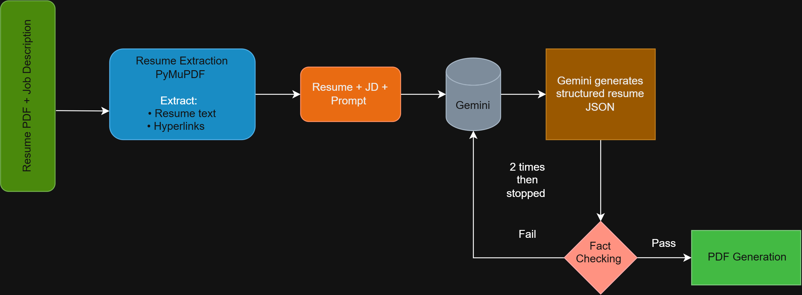

# 🧠 AI Resume Generation Pipeline

> AI-powered resume tailoring with fact checking and one-page PDF generation.

## 🌐 Live Demo

<video controls src="live.mp4" title="Title"></video>

**Try the application:**  
[https://ai-resume-tailor-sable.vercel.app/](https://ai-resume-tailor-sable.vercel.app/)

---



## Stage 1 — Resume Extraction

The uploaded PDF is first processed before any AI generation takes place.
PyMuPDF extracts the resume's text and the PDF's hyperlink annotations.
Instead, the original PDF is treated as the source of truth.

## Stage 2 — Hyperlink Extraction

Find hyperlink annotation
          ↓
Get exact hyperlink rectangle
          ↓
Extract text spans/words
          ↓
Find words inside the rectangle
          ↓
Displayed text ↔ URL

this will allow the output in this format 

GitHub → https://github.com/...
LinkedIn → https://linkedin.com/...
Portfolio → https://portfolio...

## Stage 3 — Job Description Analysis

The extracted resume text and the supplied job description are passed to the resume-generation prompt.

Gemini uses the job description to determine which existing candidate experience, skills, projects, and achievements are most relevant.

The job description is used to guide selection and rewriting, not to invent new candidate experience.

## Stage 4 — Gemini Resume Generation

Gemini generates a structured resume representation.

Instead of asking the model to directly generate HTML or PDF content, the system separates content generation from presentation.

The structured output contains sections such as:

* Summary
* Education
* Skills
* Experience
* Projects
* Achievements

## Stage 5 — Fact Checking

The generated resume is then validated against the original resume.

The validator checks:

Companies, Job titles, Employment dates, Education, Technologies, Projects, Achievements, Metrics, Experience claims

for example
```
========== FACT CHECK ==========
{
  "valid": false,
  "issues": [
    {
      "type": "unsupported_experience",
      "generated_claim": "3+ years of experience developing, optimizing, and deploying deep learning and LLM pipelines",
      "source_evidence": "3+ years of experience in object detection, image segmentation, video analytics, and deep learning.",
      "explanation": "The original resume attributes 3+ years of experience to computer vision and deep learning. LLM work appears only in a single project and is not supported as 3+ years of experience."
    }
  ],
  "checked": {
    "companies": true,
    "job_titles": true,
    "dates": true,
    "education": true,
    "technologies": true,
    "projects": true,
    "achievements": true,
    "metrics": true,
    "experience_claims": false
  }
}
================================


========== FACT CHECK FAILED ==========
Attempting one correction pass...
========================================


========== SECOND FACT CHECK ==========
{
  "valid": true,
  "issues": [],
  "checked": {
    "companies": true,
    "job_titles": true,
    "dates": true,
    "education": true,
    "technologies": true,
    "projects": true,
    "achievements": true,
    "metrics": true,
    "experience_claims": true
  }
}
=======================================
```
## Stage 6 — Controlled Correction
```
Gemini Generation
       ↓
   Fact Check
       ↓
   ┌───────┐
   │       │
  PASS    FAIL
   │       │
   │       ▼
   │   Correction
   │       ↓
   │   Fact Check
   │
   ▼
Continue
```
The correction process is intentionally bounded rather than running indefinitely.

## Stage 7 — HTML Rendering

The validated structured resume data is passed to the existing HTML resume template.

```
Structured Resume JSON
          ↓
      HTML Template
          ↓
      Final HTML
```

## Stage 8 — PDF Generation

Playwright renders the final HTML using Chromium and generates the PDF.

```
HTML
 ↓
Playwright
 ↓
Chromium
 ↓
PDF
```

## Stage 9 — One-Page Validation

The generated document is checked against the available page height.

If the content exceeds the available space, the system calculates an appropriate scale factor and regenerates the PDF so that the resume remains on a single page.

Example:

Content height: 1056px
Available height: 979px

Required scale:
979 / 1056 ≈ 0.927

# ⚙️ Setup

## Prerequisites

Make sure the following are installed:

- Python 3.11+
- Node.js 18+
- npm
- Git
- A Google Gemini API key

---

## 1. Clone the Repository

```bash
git clone https://github.com/prince0310/ai-resume-tailor.git
cd ai-resume-tailor
```
## 2. Backend Setup

Navigate to the backend:

```bash
cd backend
```

## 3. Create a Virtual Environment

Windows

```
python -m venv venv
venv\Scripts\activate
```
macOS / Linux

```
python3 -m venv venv
source venv/bin/activate
```

## 4. Install Dependencies

```
pip install -r requirements.txt
Install Playwright Chromium
```

## 5. The application uses Playwright to render the HTML resume and generate the final PDF.

```
playwright install chromium
Configure Gemini API Key
```

## 6. Create a .env file inside the backend directory:

```
backend/.env
```

Add:

```
GEMINI_API_KEY=your_gemini_api_key
```

## 7. Start the Backend

Make sure the virtual environment is activated.

From the backend directory, run:

```
python -m uvicorn main:app --reload --host 0.0.0.0 --port 8000
```

The backend will be available at:

```
http://localhost:8000
```
FastAPI Swagger documentation:

```
http://localhost:8000/docs
```
## 8. Frontend Setup

Open a new terminal and navigate to the frontend:

```
cd frontend
```

Install the Node.js dependencies:

```
npm install
```
## 9. Configure Frontend Backend URL

Create a .env.local file inside the frontend directory:

```
frontend/.env.local
```

For local backend development:

```
VITE_API_BASE_URL=http://localhost:8000
```

If you want to run the frontend locally while using the deployed Railway backend:

```
VITE_API_BASE_URL=https://your-railway-backend-url

```
## 10. Start the Frontend

Run:
```
npm run dev
```

Vite will provide a local URL, typically:

```
http://localhost:5173
```

Open that URL in your browser.

